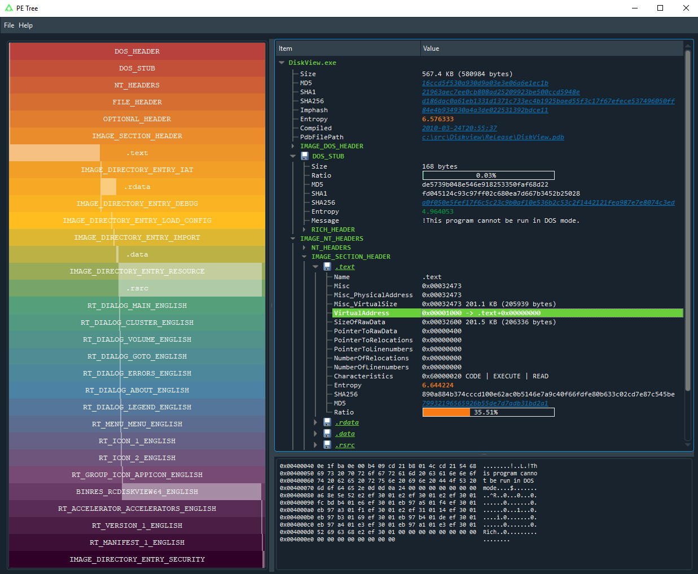
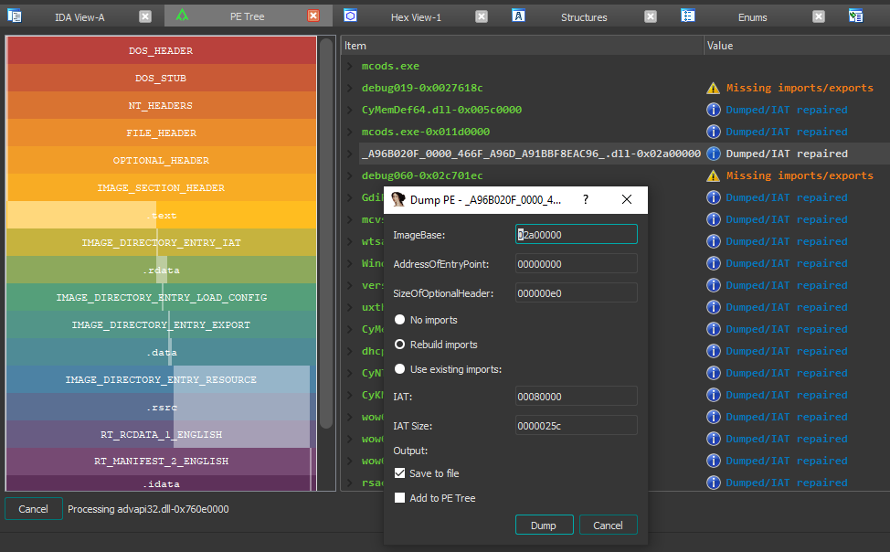

# PE Tree
> Python module for viewing [Portable Executable (PE) files](https://en.wikipedia.org/wiki/Portable_Executable) in a tree-view using [pefile](https://github.com/erocarrera/pefile) and [PyQt5](https://pypi.org/project/PyQt5/).
> Can also be used with [IDA Pro](https://www.hex-rays.com/products/ida/) to dump in-memory PE files and reconstruct imports.

- [Features](#features)
- [Application](#application)
  * [Requirements](#requirements)
  * [Installation](#installation)
    * [Windows](#windows)
    * [Mac/Linux](#maclinux)
    * [For developers](#for-developers)
  * [Usage](#usage)
  * [Dark-mode](#dark-mode)
- [IDAPython](#idapython)
  * [Requirements](#requirements-1)
  * [Installation](#installation-1)
    * [Using setuptools](#using-setuptools)
    * [Install manually](#install-manually)
    * [For developers](#for-developers-1)
  * [Usage](#usage)
  * [Examples](#examples)
    * [Dumping in-memory PE files](#dumping-in-memory-pe-files)
- [Configuration](#configuration)
  * [Overview](#overview-1)
  * [Options](#options)
  * [Location](#location)
  * [3rd party data sharing](#3rd-party-data-sharing)
- [Troubleshooting](#troubleshooting)
- [Contributing](#contributing)
  * [Developer documentation](#developer-documentation)

## Features
- Standalone application and IDAPython plugin
- Supports Windows/Linux/Mac
- Rainbow PE ratio map:
  * High-level overview of PE structures, size and file location
  * Allows for fast visual comparison of PE samples
- Displays the following PE headers in a tree view:
  * MZ header
  * DOS stub
  * Rich headers
  * NT/File/Optional headers
  * Data directories
  * Sections
  * Imports
  * Exports
  * Debug information
  * Load config
  * TLS
  * Resources
  * Version information
  * Certificates
  * Overlay
- Extract and save data from:
  * DOS stub
  * Sections
  * Resources
  * Certificates
  * Overlay
- Send data to CyberChef
- VirusTotal search of:
  * File hashes
  * PDB path
  * Timestamps
  * Section hash/name
  * Import hash/name
  * Export name
  * Resource hash
  * Certificate serial
- Standalone application;
  * Double-click VA/RVA to disassemble with capstone
  * Hex-dump data
- IDAPython plugin:
  * Easy navigation of PE file structures
  * Double-click VA/RVA to view in IDA-view/hex-view
  * Search IDB for in-memory PE files;
    * Reconstruct imports (IAT + IDT)
    * Dump reconstructed PE files
    * Automatically comment PE file structures in IDB
    * Automatically label IAT offsets in IDB

## Application

### Requirements
- Python 3+
### Installation
#### Using pip (recommended)
Install directly from GitHub using a fresh virtual environment and pip:
##### Windows
```
> virtualenv env
> env\Scripts\activate
> pip install --upgrade pip
> pip install git+https://github.com/blackberry/pe_tree.git
```
##### Mac/Linux
```
$ python3 -m venv env
$ source ./env/bin/activate
$ pip install --upgrade pip
$ pip install git+https://github.com/blackberry/pe_tree.git
```
#### For developers
Git clone the repository and setup for development:
##### Windows
```
> git clone https://github.com/blackberry/pe_tree.git
> cd pe_tree
> virtualenv env
> env\Scripts\activate
> pip install -e .
```
##### Mac/Linux
```
$ git clone https://github.com/blackberry/pe_tree.git
$ cd pe_tree
$ python3 -m venv env
$ source ./env/bin/activate
$ pip install -e .
```
### Usage
Run PE Tree and use the GUI to select a <b>file</b> to view:

```$ pe-tree```

Run PE Tree and view the specified <b>file/folder</b>:

```$ pe-tree <path>```

#### Dark-mode
Dark-mode can be enabled by installing [QDarkStyle](https://pypi.org/project/QDarkStyle/):
```
$ pip install qdarkstyle
```

## IDAPython

### Requirements
- IDA Pro 7.0+ with Python 2.7
- IDA Pro 7.4+ with Python 2.7 or 3.x
### Installation
To install and run as an IDAPython plugin you can either use setuptools or install manually.

#### Using setuptools
1. Download pe_tree and install for the <b>global</b> Python interpreter used by IDA:
   
    ```
    $ git clone https://github.com/blackberry/pe_tree.git
    $ cd pe_tree
    $ python setup.py develop --ida
    ```
3. Copy [pe_tree_ida.py](./pe_tree_ida.py) to your [IDA plugins folder](#ida-plugins-folder)

#### Install manually
1. Download pe_tree and install requirements for the <b>global</b> Python interpreter used by IDA:
   
    ```
    $ git clone https://github.com/blackberry/pe_tree.git
    $ cd pe_tree
    $ pip install -r requirements.txt
    ```
3. Copy [pe_tree_ida.py](./pe_tree_ida.py) and the contents of `./pe_tree/` to your [IDA plugins folder](#ida-plugins-folder)

#### For developers
To simply run as a script under IDA first install the pe_tree package requirements for the <b>global</b> Python installation:

```
$ pip install -r requirements.txt
```

Then run [pe_tree_ida.py](./pe_tree_ida.py) under IDA:

`File -> Script file... -> pe_tree_ida.py -> Open`

### IDA plugins folder

| OS      | Plugins folder                              |
| :------ | :------------------------------------------ |
| Windows | `%ProgramFiles%\IDA Pro 7.X\plugins`        |
| Linux   | `/opt/ida-7.X/plugins`                      |
| Mac     | `~/.idapro/plugins`                         |

### Usage

1. Run IDA and disassemble a PE file (select `Manual Load` and `Load Resources` for best results!)
2. Click `Edit -> Plugins -> PE Tree`

### Examples

#### Dumping in-memory PE files

Below are the basic steps to dump a packed PE file (for example MPRESS or [UPX](https://upx.github.io/)) and rebuild imports (assuming the image base/entry-point is fairly standard):

1. Launch IDA Pro and disassemble an MPRESS or UPX packed PE file (select `Manual Load` and `Load Resources`)
2. Select debugger (Windows or [Bochs](http://bochs.sourceforge.net/)) and run until OEP (usually 0x00401000)
3. At this point you could take a memory snapshot (saving all segments) and save the IDB for later
4. Ensure IDA has found all code `Options -> General -> Analysis -> Reanalyze program`
5. Open PE Tree, right-click and choose `Add PE -> Search IDB`
6. Right click on `HEADER-0x00400000` (or appropriate module) and select `Dump...`
7. Specify the `AddressOfEntryPoint` (typically 0x1000)
8. Ensure `Rebuild imports` is selected
9. Dump!

A new executable will be created using the unpacked section data obtained from memory/IDB, and a new section named [.idata](https://docs.microsoft.com/en-us/windows/win32/debug/pe-format#the-idata-section) containing the rebuilt IAT, hint name table and IDT will be appended to the PE file. 
If the entry-point memory segment has been marked writable during execution (via [VirtualProtect](https://docs.microsoft.com/en-us/windows/win32/api/memoryapi/nf-memoryapi-virtualprotect) for example) then the EP section characteristics will also be marked writable.
Finally, the BASERELOC, BOUND_IMPORT and SECURITY data directories are marked null, and the OPTIONAL_HEADER checksum is recalculated (if enabled via config)

Using the above approach it is possible to dump many in-memory PE files that have either been unpacked, remotely injected, reflectively loaded or hollowed etc.

## Configuration

### Overview

The configuration is stored in an INI file and defaults to the following values:

```
[config]
debug = False
fonts = Consolas,Monospace,Courier
virustotal_url = https://www.virustotal.com/gui/search
cyberchef_url = https://gchq.github.io/CyberChef

[dump]
enable = True
recalculate_pe_checksum = False
```

### Options

| Section | Option                  | Type    | Description                                              |
| :------ | :---------------------- | :------ | :------------------------------------------------------- |
| config  | debug                   | boolean | Print pefile.dump() to output                            |
| config  | fonts                   | string  | Comma-separated list of font names for UI                |
| config  | virustotal_url          | string  | VirusTotal search URL                                    |
| config  | cyberchef_url           | string  | CyberChef URL                                            |
| dump    | enable                  | boolean | Enable process dumping/IAT rebuilding in IDA             |
| dump    | recalculate_pe_checksum | boolean | Recalculate PE header checksum (slow!)                   |

### Location

| Type        | OS        | Path                                    |
|-------------|-----------|:----------------------------------------|
| Application | Windows   | `%TEMP%\pe_tree.ini`                    |
| Application | Linux/Mac | `/tmp/pe_tree.ini`                      |
| IDAPython   | Windows   | `%APPDATA%\HexRays\IDA Pro\pe_tree.ini` |
| IDAPython   | Linux/Mac | `~/.idapro/pe_tree.ini`                 |

### 3rd party data sharing

The following information will be shared with 3rd party web-applications (depending on configuration) under the following conditions:

#### VirusTotal

If the [VirusTotal](https://www.virustotal.com/) URL is specified in the configuration then metadata such as file hashes, timestamps, etc will be sent to VirusTotal for processing when the user clicks on highlighted links or selects "VirusTotal search" from the right-click context menu.

#### CyberChef

If the [CyberChef](https://github.com/gchq/CyberChef) URL is present in the configuration then any file data will be base64 encoded and sent to CyberChef for processing when the user selects "CyberChef" from the right-click context menu.

## Troubleshooting

#### AttributeError: module 'pip' has no attribute 'main'
or
#### PyQt5 fails to install under Linux
Try to upgrade pip to version 20.0+:
```
$ pip install --upgrade pip
```

#### ModuleNotFoundError: No module named 'PyQt5.sip'
Try uninstalling and reinstalling PyQt5 as follows:
```
pip uninstall PyQt5
pip uninstall PyQt5-sip
pip install PyQt5 PyQt5-sip
```

#### Missing imports after dumping
Ensure IDA has found and disassembled all code:

```Options -> General -> Analysis -> Reanalyze program```

After this is completed try to dump/rebuild imports again.

## Contributing

Please feel free to contribute! Issues and pull requests are most welcome.

### Developer documentation

To build documentation from source using [Sphinx](https://www.sphinx-doc.org/en/master/):
```
$ pip install sphinx
$ sphinx-apidoc -o ./doc/source/ .
$ sphinx-build -b html ./doc/source ./doc/build -E
```
To view the documentation open `./doc/build/index.html` in a web-browser.

## License

PE Tree is distributed under the Apache License. See [LICENSE](LICENSE) for more information. 
