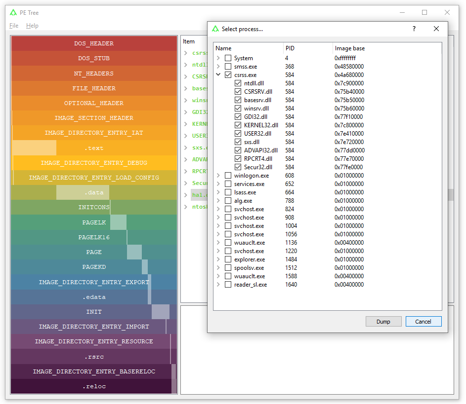
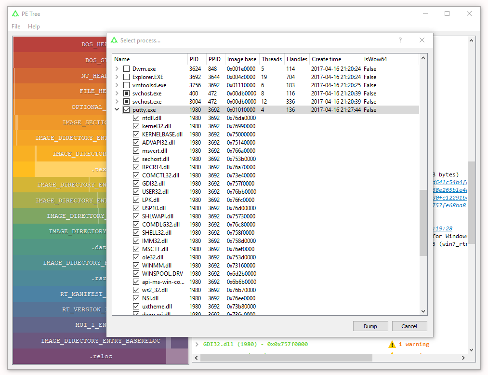
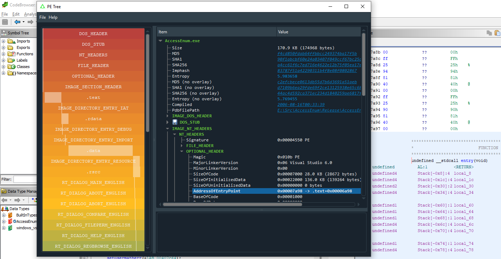
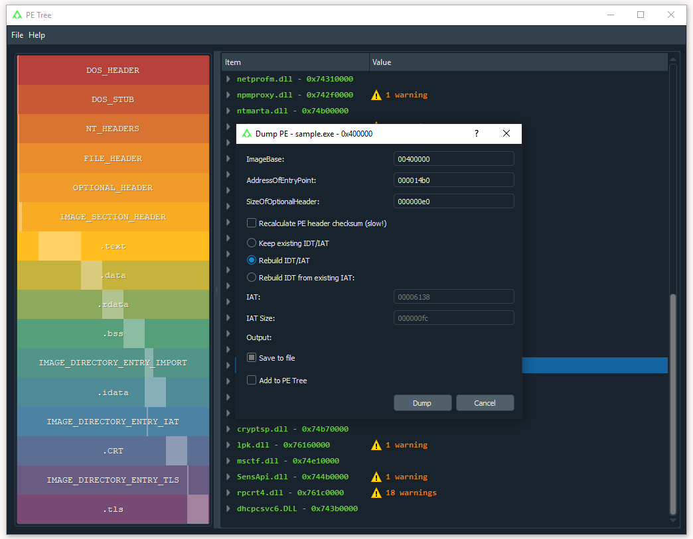

# PE Tree
PE Tree is a Python module for viewing [Portable Executable (PE) files](https://en.wikipedia.org/wiki/Portable_Executable) in a tree-view using [pefile](https://github.com/erocarrera/pefile) and [PyQt5](https://pypi.org/project/PyQt5/).
It can also be used with [IDA Pro](https://www.hex-rays.com/products/ida/), [Ghidra](https://ghidra-sre.org/), [Volatility](https://github.com/volatilityfoundation/volatility3), [Rekall](http://www.rekall-forensic.com/) and [minidump](https://github.com/skelsec/minidump) to view and dump in-memory PE files, as well as perform import table reconstruction.

## Table of contents

1. [Features](#features)
2. [Application](#application)
    * [Requirements](#requirements)
    * [Features](#features-1)
    * [Installation](#installation)
        * [Windows](#windows)
        * [Mac/Linux](#maclinux)
        * [For developers](#for-developers)
    * [Usage](#usage)
    * [Dark-mode](#dark-mode)
3. [IDAPython](#idapython)
    * [Requirements](#requirements-1)
    * [Features](#features-2)
    * [Installation](#installation-1)
        * [Using setuptools](#using-setuptools)
        * [Install manually](#install-manually)
        * [For developers](#for-developers-1)
    * [Usage](#usage)
    * [Example](#example)
        * [Dumping in-memory PE files](#dumping-in-memory-pe-files)
4. [Rekall](#rekall)
    * [Requirements](#requirements-2)
    * [Features](#features-3)
    * [Installation](#installation-2)
    * [Usage](#usage-2)
5. [Volatility](#volatility)
    * [Requirements](#requirements-3)
    * [Features](#features-4)
    * [Installation](#installation-3)
    * [Usage](#usage-3)
6. [Ghidra](#ghidra)
    * [Requirements](#requirements-4)
    * [Features](#features-5)
    * [Installation](#installation-4)
    * [Usage](#usage-4)
7. [Minidump](#minidump)
    * [Requirements](#requirements-5)
    * [Features](#features-6)
    * [Installation](#installation-5)
    * [Usage](#usage-5)
8. [Configuration](#configuration)
    * [Overview](#overview)
    * [Options](#options)
    * [Location](#location)
    * [3rd party data sharing](#3rd-party-data-sharing)
9. [Troubleshooting](#troubleshooting)
10. [Contributing](#contributing)
    * [Developer documentation](#developer-documentation)
11. [License](#license)

## Features
* Standalone application with plugins for:
    * IDA Pro
    * Ghidra
    * Volatility
    * Rekall
    * Minidumps
    * Carving
* Supports Windows, Linux and Mac
* Parsing PE files and memory images from:
    * File-system
    * ZIP archives (including password protected)
    * Windows memory dumps (raw, EWF, vmem etc.)
    * Live Windows memory (using rekall)
    * Windows Minidump
    * IDA Pro database
    * Ghidra database
    * Binary file carving
* Rainbow PE map:
    * Provides a high-level overview of PE structures, size and file location
    * Allows for fast visual overview and comparison of PE samples
* Displays the following PE headers in a tree-view:
    * MZ header
    * DOS stub
    * Rich headers
    * NT/File/Optional headers
    * Data directories
    * Sections
    * Imports
    * Exports
    * Debug information
    * Load config
    * TLS
    * Resources
    * Version information
    * Certificates
    * Overlay
* Extract and save data from:
    * DOS stub
    * Sections
    * Resources
    * Certificates
    * Overlay
    * Export to CyberChef for further manipulation
* Perform VirusTotal searches of:
    * File hashes
    * PDB path
    * Timestamps
    * Section hash/name
    * Import hash/name
    * Export name
    * Resource hash
    * Certificate serial
* Dump loaded PE images from memory:
    * Fix up section pointers and sizes
    * Fix up PE headers:
        * Remove unnecessary data directory pointers
        * Recalculate PE checksum
        * Update entry-point
    * Reconstruct import address and directory tables (IAT/IDT) using several methods:
        1. Use existing IAT/IDT
        2. Rebuild IDT from existing IAT
        3. Rebuild IAT and IDT from disassembly (using IDA Pro, Ghidra or capstone)

## Application

>*The PE Tree standalone application finds portable executables in files, folders and ZIP archives.*


### Requirements
* Python 3.5+

### Features
* Scan files and folders for PE files
* Extract PE files from ZIP archives (including password protected with *infected*)
* Carve PE files from binary files
* Double-click VA/RVA to disassemble with capstone
* Hex-dump data

### Installation

#### Using pip (recommended)
Install directly from GitHub using a fresh virtual environment and pip:

##### Windows
```
> virtualenv env
> env\Scripts\activate
> pip install --upgrade pip
> pip install git+https://github.com/blackberry/pe_tree.git
```

##### Mac/Linux
```
$ python3 -m venv env
$ source ./env/bin/activate
$ pip install --upgrade pip
$ pip install git+https://github.com/blackberry/pe_tree.git
```
#### For developers
Git clone the repository and setup for development:

##### Windows
```
> git clone https://github.com/blackberry/pe_tree.git
> cd pe_tree
> virtualenv env
> env\Scripts\activate
> pip install -e .
```

##### Mac/Linux
```
$ git clone https://github.com/blackberry/pe_tree.git
$ cd pe_tree
$ python3 -m venv env
$ source ./env/bin/activate
$ pip install -e .
```

### Usage

Run PE Tree and scan for portable executables in files, folders and ZIP archives:

```
$ pe-tree -h
usage: pe-tree [-h] [filenames [filenames ...]]

PE-Tree

positional arguments:
  filenames   Path(s) to file/folder/zip

optional arguments:
  -h, --help  show this help message and exit
```

Run PE Tree and attempt to [carve](https://en.wikipedia.org/wiki/File_carving) portable executable files from a binary file:

```
$ pe-tree-carve -h
usage: pe-tree-carve [-h] filename

PE-Tree (Carve)

positional arguments:
  filename    Path to file to carve

optional arguments:
  -h, --help  show this help message and exit
```

#### Dark-mode
Dark-mode can be enabled by installing [QDarkStyle](https://pypi.org/project/QDarkStyle/):
```
$ pip install qdarkstyle
```

## IDAPython

>*The PE Tree IDAPython plugin finds portable executables in IDA databases.*


### Requirements
* IDA Pro 7.0+ with Python 2.7
* IDA Pro 7.4+ with Python 2.7 or 3.5+

### Features
* Easy navigation of PE file structures
* Double-click on a memory address in PE Tree to view in *IDA-view* or *hex-view*
* Search an IDB for in-memory PE images and:
    * Reconstruct imports (IAT + IDT)
    * Dump reconstructed PE files
    * Automatically comment PE file structures in IDB
    * Automatically label IAT offsets in IDB

### Installation
To install and run as an IDAPython plugin you can either use setuptools or install manually.

#### Using setuptools
1. Download pe_tree and install for the **global** Python interpreter used by IDA:
   
    ```
    $ git clone https://github.com/blackberry/pe_tree.git
    $ cd pe_tree
    $ python setup.py develop --ida
    ```
3. Copy [pe_tree_ida.py](./pe_tree_ida.py) to your [IDA plugins folder](#ida-plugins-folder)

#### Install manually
1. Download pe_tree and install requirements for the **global** Python interpreter used by IDA:
   
    ```
    $ git clone https://github.com/blackberry/pe_tree.git
    $ cd pe_tree
    $ pip install -r requirements.txt
    ```
3. Copy [pe_tree_ida.py](./pe_tree_ida.py) and the contents of `./pe_tree/` to your [IDA plugins folder](#ida-plugins-folder)

#### For developers
To forgo installing as a plugin, and simply run as a script under IDA, first install the pe_tree package requirements for the **global** Python installation:

```
$ pip install -r requirements.txt
```

Then run [pe_tree_ida.py](./pe_tree_ida.py) under IDA:

`File -> Script file... -> pe_tree_ida.py -> Open`

### IDA plugins folder

| OS      | Plugins folder                              |
| :------ | :------------------------------------------ |
| Windows | `%ProgramFiles%\IDA Pro 7.X\plugins`        |
| Linux   | `/opt/ida-7.X/plugins`                      |
| Mac     | `~/.idapro/plugins`                         |

### Usage

1. Launch IDA Pro and disassemble a PE file (always select **Manual Load** and **Load Resources** for best results!)
2. Load the PE Tree plugin:

    ```Edit -> Plugins -> PE Tree```

### Example

#### Dumping in-memory PE files

Below are the basic steps to dump a packed PE file (for example MPRESS or [UPX](https://upx.github.io/)) and reconstruct imports (assuming the image base/entry-point is fairly standard):

1. Launch IDA Pro and disassemble an MPRESS or UPX packed PE file (select **Manual Load** and **Load Resources**)

2. Select a debugger (Windows or [Bochs](http://bochs.sourceforge.net/)) and run until OEP (usually 0x00401000, but not always!)

3. At this point you could take a memory snapshot (saving all segments) and save the IDB for later

4. Ensure IDA has found all code:

    ```Options -> General -> Analysis -> Reanalyze program```

5. Open the PE Tree IDAPython plugin, right-click in the right-hand pane and select:

    ```Add PE -> Search IDB```

    This will scan the IDB for MZ/PE headers and display any modules it finds.

6. Right-click on **HEADER-0x00400000** (or appropriate module name) and select **Dump...**

7. Specify the **AddressOfEntryPoint** (typically 0x1000, but again, not always!)

8. Ensure **Rebuild IDT/IAT** is selected

9. Dump!

A new executable will be created using the unpacked section data obtained from memory/IDB, whilst a new section named `.pe_tree` and containing the rebuilt IAT, hint name table and IDT will be appended to the PE file (much like an [.idata](https://docs.microsoft.com/en-us/windows/win32/debug/pe-format#the-idata-section) section). 
If the entry-point memory segment has been marked writable during execution (via [VirtualProtect](https://docs.microsoft.com/en-us/windows/win32/api/memoryapi/nf-memoryapi-virtualprotect) for example) then the entry-point section's characteristics will also be marked writable.
Finally, the BASERELOC, BOUND_IMPORT and SECURITY data directories are marked null, and the OPTIONAL_HEADER checksum is recalculated (if specified).

Using the above approach it is possible to dump many in-memory PE files that have either been unpacked, injected, reflectively loaded or hollowed etc.

## Rekall

>*The PE Tree Rekall plugin finds portable executables in Windows memory dumps.*



### Requirements
* Python 3+

### Features
* Operates against a Windows memory dump or a live system 
* View, dump and reconstruct PE modules from:
    * Active processes and DLLs
    * Loaded kernel-mode drivers

### Installation

1. Install Rekall from [GitHub](https://github.com/google/rekall#quick-start).
2. Install PE Tree standalone application (see [Installation](#installation)) under the same virtual environment.

### Usage

Run Rekall and view active processes, DLLs and drivers on a live system:

```
$ rekall --live Memory
[1] Live (Memory) 00:00:00> run -i pe_tree_rekall.py
```

Alternatively, run Rekall/PE Tree against an existing memory dump:

```
$rekall -f memory.vmem
[1] memory.vmem 00:00:00> run -i pe_tree_rekall.py
```

## Volatility

>*The PE Tree Volatility plugin finds portable executables in Windows memory dumps.*



### Requirements
* Python 3.5+

### Features
* Operates against a Windows memory dump
* View, dump and reconstruct PE modules from:
    * Active processes and DLLs
    * Loaded kernel-mode drivers

### Installation

1. Install Volatility3 from [GitHub](https://github.com/volatilityfoundation/volatility3#quick-start).
2. Install PE Tree standalone application (see [Installation](#installation)) under the same virtual environment.

### Usage

```
$ pe-tree-vol -h
usage: pe-tree-vol [-h] filename

PE-Tree (Volatility)

positional arguments:
  filename    Path to memory dump

optional arguments:
  -h, --help  show this help message and exit
```

## Ghidra

>*The PE Tree Ghidra plugin finds portable executables in Ghidra databases.*



### Requirements
* Python 3.5+
* Ghidra Bridge

### Features
* Easy navigation of PE file structures
* Double-click on a memory address in PE Tree to view in Ghidra disassembly/hex-view
* Reconstruct imports (IAT + IDT)
* Dump reconstructed PE files

### Installation

1. Install PE Tree (see [Installation](#installation))
2. Install [Ghidra Bridge](https://github.com/justfoxing/ghidra_bridge#install-the-ghidra-bridge-package-and-server-scripts)

### Usage

1. Start the [Ghidra Bridge server](https://github.com/justfoxing/ghidra_bridge#start-server)
2. Run the PE Tree Ghidra plugin

```
$ pe-tree-ghidra -h
usage: pe-tree-ghidra [-h] [--server SERVER] [--port PORT]

PE-Tree (Ghidra)

optional arguments:
  -h, --help       show this help message and exit
  --server SERVER  Ghidra bridge server IP (default: 127.0.0.1)
  --port PORT      Ghidra bridge server port (default: 4768)
```

## Minidump

>*The PE Tree Minidump plugin finds portable executables in Windows Minidumps.*



### Requirements
* Python 3.6+
* [minidump](https://github.com/skelsec/minidump)

### Features
* View, dump and reconstruct PE modules from a Windows Minidump (.dmp) file

### Installation

1. Install PE Tree (see [Installation](#installation))
2. Install [minidump](https://github.com/skelsec/minidump) (`pip install minidump`)

### Usage

```
$ pe-tree-minidump -h
usage: pe-tree-minidump [-h] filename

PE-Tree (Minidump)

positional arguments:
  filename    Path to .dmp file

optional arguments:
  -h, --help  show this help message and exit
```

## Configuration

### Overview

The configuration is stored in an INI file and defaults to the following values:

```
[config]
debug = False
fonts = Consolas,Monospace,Courier
passwords = ,infected
virustotal_url = https://www.virustotal.com/gui/search
cyberchef_url = https://gchq.github.io/CyberChef
```

### Options

| Section | Option                  | Type    | Description                                              |
| :------ | :---------------------- | :------ | :------------------------------------------------------- |
| config  | debug                   | boolean | Print pefile.dump() to output                            |
| config  | fonts                   | string  | Comma-separated list of font names for UI                |
| config  | passwords               | string  | Comma-separated list of ZIP file passwords               |
| config  | virustotal_url          | string  | VirusTotal search URL                                    |
| config  | cyberchef_url           | string  | CyberChef URL                                            |

### Location

| Type        | OS        | Path                                    |
|-------------|-----------|:----------------------------------------|
| Application | Windows   | `%TEMP%\pe_tree.ini`                    |
| Application | Linux/Mac | `/tmp/pe_tree.ini`                      |
| IDAPython   | Windows   | `%APPDATA%\HexRays\IDA Pro\pe_tree.ini` |
| IDAPython   | Linux/Mac | `~/.idapro/pe_tree.ini`                 |
| Rekall      | Windows   | `%TEMP%\pe_tree_rekall.ini`             |
| Rekall      | Linux/Mac | `/tmp/pe_tree_rekall.ini`               |
| Volatility  | Windows   | `%TEMP%\pe_tree_volatility.ini`         |
| Volatility  | Linux/Mac | `/tmp/pe_tree_volatility.ini`           |
| Ghidra      | Windows   | `%TEMP%\pe_tree_ghidra.ini`             |
| Ghidra      | Linux/Mac | `/tmp/pe_tree_ghidra.ini`               |
| Minidump    | Windows   | `%TEMP%\pe_tree_minidump.ini`           |
| Minidump    | Linux/Mac | `/tmp/pe_tree_minidump.ini`             |
| Carve       | Windows   | `%TEMP%\pe_tree_carve.ini`              |
| Carve       | Linux/Mac | `/tmp/pe_tree_carve.ini`                |

### 3rd party data sharing

The following information will be shared with 3rd party web-applications (depending on configuration) under the following conditions:

#### VirusTotal

If the [VirusTotal](https://www.virustotal.com/) URL is specified in the configuration then metadata such as file hashes, timestamps, etc will be sent to VirusTotal for processing when the user clicks on highlighted links or selects "VirusTotal search" from the right-click context menu.

#### CyberChef

If the [CyberChef](https://github.com/gchq/CyberChef) URL is present in the configuration then any file data will be base64 encoded and sent to CyberChef for processing when the user selects "CyberChef" from the right-click context menu.

## Troubleshooting

#### AttributeError: module 'pip' has no attribute 'main'
or

#### PyQt5 fails to install under Linux
Try to upgrade pip to version 20.0+:
```
$ pip install --upgrade pip
```

#### ModuleNotFoundError: No module named 'PyQt5.sip'
Try uninstalling and reinstalling PyQt5 as follows:
```
pip uninstall PyQt5
pip uninstall PyQt5-sip
pip install PyQt5 PyQt5-sip
```

#### Missing imports after dumping
Ensure IDA has found and disassembled all code:

```Options -> General -> Analysis -> Reanalyze program```

After this is completed try to dump/rebuild imports again.

## Contributing

Please feel free to contribute! Issues and pull requests are most welcome.

### Developer documentation

To build documentation from source using [Sphinx](https://www.sphinx-doc.org/en/master/):

```
$ pip install sphinx
$ sphinx-apidoc -o ./doc/source/ .
$ sphinx-build -b html ./doc/source ./doc/build -E
```

To view the documentation open `./doc/build/index.html` in a web-browser.

## Authors

*Tom Bonner* - [tombonner](https://github.com/tombonner) - [@thomas_bonner](https://twitter.com/thomas_bonner)

## License

PE Tree is distributed under the Apache License. See [LICENSE](LICENSE) for more information. 
